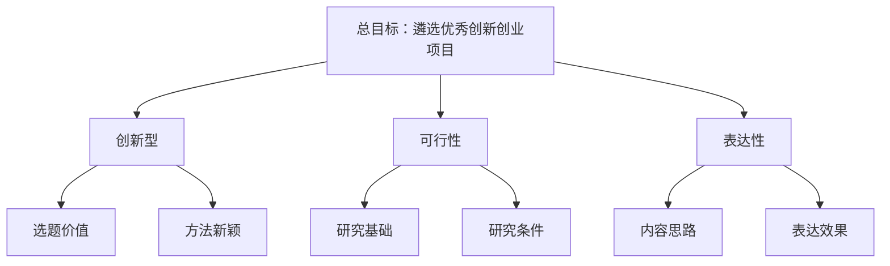

# AHP Practice · 层次分析法实验

> 医学信息分析课程实习内容 · Course practice for Medical Information Analysis

用 Python + NumPy 实现层次分析法（AHP）的三个递进练习：矩阵特征根计算、个人毕业去向决策、创新创业项目遴选评价体系构建。

Three progressive AHP exercises implemented in Python + NumPy: eigenvector computation, a personal career-choice decision, and an evaluation system for innovation project selection.

---

## 目录 · Table of Contents

- [项目简介 · Overview](#项目简介--overview)
- [目录结构 · Repository Layout](#目录结构--repository-layout)
- [环境要求 · Requirements](#环境要求--requirements)
- [快速开始 · Quick Start](#快速开始--quick-start)
- [实验内容 · Exercises](#实验内容--exercises)
- [方法说明 · Methodology](#方法说明--methodology)
- [输出示例 · Sample Output](#输出示例--sample-output)
- [说明 · Notes](#说明--notes)
---

## 项目简介 · Overview

本仓库为**医学信息分析**课程实习的实践代码，围绕层次分析法（AHP, Analytic Hierarchy Process）展开。

This repository contains practice code for the **Medical Information Analysis** course, centered on the Analytic Hierarchy Process (AHP).

AHP 是一种将复杂决策问题分解为递阶层次结构、通过两两比较确定权重、并进行一致性检验的多准则决策方法。本仓库用**和积法**（列归一化 → 行求和 → 归一化）求解各判断矩阵的特征向量与最大特征根。

AHP decomposes a complex decision problem into a hierarchy, derives weights from pairwise comparisons, and validates them with a consistency check. This repository uses the **sum-product method** (column normalization → row summation → normalization) to solve each judgment matrix for its eigenvector and maximum eigenvalue.

---

## 目录结构 · Repository Layout

```
.
├── README.md                                  # 中英文说明文档 / This file
├── .gitignore
├── src/                                       # 源代码 / Source code
│   ├── ahp_01_最大特征根.py                    # 练习1：和积法求特征向量与最大特征根
│   ├── ahp_02_毕业去向选择.py                  # 练习2：毕业去向选择的交互式 AHP
│   └── ahp_03_项目遴选评价体系.py              # 练习3：面向评委的项目评价体系构建
├── example/                                   # 示例输出报告 / Sample reports
│   ├── AHP毕业去向报告_张三_20260924_112149.txt
│   └── AHP项目遴选评价体系_张三_20260924_113503.txt
```

| 文件 / File | 说明 / Description |
| --- | --- |
| `src/ahp_01_最大特征根.py` | 对给定 4×4 判断矩阵，用和积法求特征向量 W 与最大特征根 λmax。<br>Solves a given 4×4 judgment matrix for W and λmax. |
| `src/ahp_02_毕业去向选择.py` | 5 个约束 × 4 个方案的完整 AHP，交互式完成 40 次成对比较并生成报告.<br>Full AHP with 5 criteria × 4 alternatives; 40 interactive comparisons. |
| `src/ahp_03_项目遴选评价体系.py` | 三层递阶体系（准则层 3 项、指标层 6 项），交互式 6 次比较，支持记录判断依据.<br>Three-level hierarchy (3 criteria, 6 indicators) with 6 comparisons. |

---

## 环境要求 · Requirements

- Python 3.8+
- NumPy

```bash
pip install numpy
```

---

## 快速开始 · Quick Start

```bash
# 练习1：直接运行，输出结果
python src/ahp_01_最大特征根.py

# 练习2 / 3：按提示输入姓名并完成成对比较
python src/ahp_02_毕业去向选择.py
python src/ahp_03_项目遴选评价体系.py
```

交互时使用字母菜单选择，例如：

```text
  [1/40] 「发展前景」相比「地理位置」
      「发展前景」 vs 「地理位置」：
        (A) 前者 极端 重要  [9]
        (B) 前者 强烈 重要  [7]
        (C) 前者 明显 重要  [5]
        (D) 前者 稍微 重要  [3]
        (E) 两者 同等 重要  [1]
        (F) 后者 稍微 重要  [1/3]
        (G) 后者 明显 重要  [1/5]
        (H) 后者 强烈 重要  [1/7]
        (I) 后者 极端 重要  [1/9]
        (J) 自己输入分值
      请选择 → C
```

> 选 `J` 可自行输入分值，支持 `5`、`1/3`、`0.2` 等写法。
> Press `J` to enter a custom value; formats like `5`, `1/3`, and `0.2` are all accepted.

---

## 实验内容 · Exercises

### 练习 1 · 最大特征根与特征向量

**Exercise 1 · Eigenvector and Maximum Eigenvalue**

给定判断矩阵：

Given the judgment matrix:

$$
A=\begin{bmatrix}
1 & 8 & 5 & 3 \\
1/8 & 1 & 1/2 & 1/6 \\
1/5 & 2 & 1 & 1/3 \\
1/3 & 6 & 3 & 1
\end{bmatrix}
$$

用和积法求得：

Solving with the sum-product method:

| 项目 / Item | 结果 / Result |
| --- | --- |
| 特征向量 W | (0.5666, 0.0560, 0.1044, 0.2730)ᵀ |
| 最大特征根 λmax | 4.0666 |

（与 `numpy.linalg.eig` 的精确解 λmax = 4.0665 相比误差极小。／Very close to the exact solution λmax = 4.0665 from `numpy.linalg.eig`.)

---

### 练习 2 · 毕业去向选择

**Exercise 2 · Career Choice Decision**

| 层次 / Level | 内容 / Content |
| --- | --- |
| 总目标 / Goal | 合理的毕业选择建议 |
| 约束层 / Criteria | 发展前景、地理位置、工作环境、个人兴趣、家长期望 |
| 方案层 / Alternatives | 国内深造、留学深造、自主创业、直接就业 |

需完成 40 次成对比较（约束间 10 次 + 每个约束下方案 6 次 × 5）。

Requires 40 pairwise comparisons (10 criteria pairs + 6 alternative pairs × 5 criteria).

**示例结果**（示例报告见 `example/`）／**Sample result** (see `example/`):

| 约束 / Criterion | 权重 / Weight |
| --- | --- |
| 发展前景 | 0.3999 |
| 个人兴趣 | 0.3753 |
| 工作环境 | 0.1086 |
| 家长期望 | 0.0827 |
| 地理位置 | 0.0335 |

| 毕业去向 / Choice | 综合得分 / Score |
| --- | --- |
| **留学深造** | **0.5573** |
| 国内深造 | 0.2765 |
| 自主创业 | 0.1151 |
| 直接就业 | 0.0511 |

---

### 练习 3 · 创新创业项目遴选评价体系

**Exercise 3 · Evaluation System for Innovation Projects**

三层递阶结构（无方案层，只输出权重体系）：

Three-level hierarchy (no alternative layer; weights only):



需完成 6 次成对比较，每题可附一句判断依据，报告会汇总这些依据。

Requires 6 pairwise comparisons; each can carry a one-line rationale, which is collected into the report.

**示例结果**／**Sample result**:

| 准则 / Criterion | 权重 / Weight |
| --- | --- |
| **创新型** | **0.6539** |
| 可行性 | 0.2106 |
| 表达性 | 0.1355 |

| 指标 / Indicator | 组合权重 / Global Weight |
| --- | --- |
| **选题价值** | **0.4904** |
| 研究基础 | 0.1755 |
| 方法新颖 | 0.1635 |
| 内容思路 | 0.1130 |
| 研究条件 | 0.0351 |
| 表达效果 | 0.0226 |

λmax = 3.0012，CR = 0.0011（通过一致性检验／passes consistency check）

---

## 方法说明 · Methodology

### 和积法步骤 · Sum-Product Method

1. **列归一化** / Column normalization

$$
b_{ij}=\frac{a_{ij}}{\sum_{k=1}^{n}a_{kj}}
$$

2. **按行求和** / Row summation

$$
\bar{w}_i=\sum_{j=1}^{n}b_{ij}
$$

3. **归一化得权重** / Normalize to weights

$$
w_i=\frac{\bar{w}_i}{\sum_{k=1}^{n}\bar{w}_k}
$$

4. **求最大特征根** / Maximum eigenvalue

$$
\lambda_{\max}=\frac{1}{n}\sum_{i=1}^{n}\frac{(AW)_i}{w_i}
$$

### 一致性检验 · Consistency Check

$$
CI=\frac{\lambda_{\max}-n}{n-1},\qquad CR=\frac{CI}{RI}
$$

当 CR < 0.1 时认为判断矩阵一致性可接受。RI 为随机一致性指标（n=3 时 0.58，n=4 时 0.90，n=5 时 1.12）。

CR < 0.1 indicates acceptable consistency. RI is the random consistency index (0.58 for n=3, 0.90 for n=4, 1.12 for n=5).

### 层次总排序 · Global Priority

$$
S_i=\sum_{k=1}^{m} w_k \times s_{ik}
$$

其中 w<sub>k</sub> 为第 k 个约束的权重，s<sub>ik</sub> 为方案 i 在第 k 个约束下的权重。

Where w<sub>k</sub> is the weight of criterion k and s<sub>ik</sub> is the weight of alternative i under criterion k.

---

## 输出示例 · Sample Output

运行练习 2／3 后会生成文本报告，文件名包含姓名与时间戳（姓名在日期之前）：

Running exercises 2/3 generates a text report whose filename contains the name and timestamp (name before date):

```
AHP毕业去向报告_张三_20260924_112149.txt
AHP项目遴选评价体系_张三_20260924_113503.txt
```

报告包含：权重表、一致性检验明细、综合排名、判断依据记录。

The report includes weight tables, per-matrix consistency details, overall ranking, and recorded rationales.

---

## 说明 · Notes

- 层次结构与判断标度依据课程实验要求设计，权重数值取决于使用者填写的两两比较结果。
  Hierarchy structures and scales follow the course requirements; resulting weights depend on the pairwise judgments entered.
- 报告中的示例姓名与数据仅用于演示。
  Sample names and data in reports are for demonstration only.
- 一致性检验可能不通过，此时应重新审视判断矩阵中的矛盾之处。
  The consistency check may fail; in that case, revisit contradictions in the judgment matrix.

---

## 许可 · License

本项目为课程实习作业，仅供学习交流使用。

This project is coursework for academic purposes and is intended for learning and reference only.
